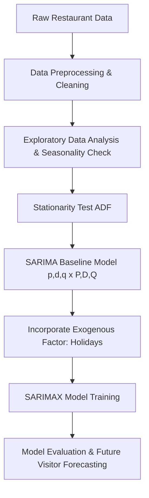

# 🍽️ Restaurant Visitors Forecasting Using SARIMAX

[](https://www.python.org/)
[](https://jupyter.org/)
[](LICENSE)

A comprehensive time-series forecasting project that predicts daily restaurant visitor counts using **SARIMAX** (Seasonal AutoRegressive Integrated Moving Average with eXogenous factors). This model incorporates weekly seasonality, trend patterns, and external calendar variables like holidays to provide accurate short-term demand forecasting.

---

## 📌 Table of Contents
- [Overview](#-overview)
- [Key Features](#-key-features)
- [Dataset Details](#-dataset-details)
- [Methodology & Workflow](#-methodology--workflow)
- [Project Structure](#-project-structure)
- [Results & Screenshots](#-results--screenshots)
- [Installation & Setup](#-installation--setup)
- [Usage](#-usage)
- [Technologies Used](#-technologies-used)
- [Contributing](#-contributing)
- [License](#-license)

---

## 📖 Overview
Predicting customer volume is vital for the hospitality industry to manage staffing, food inventory, and operating schedules efficiently. This project models daily visitor patterns and evaluates how external factors—specifically public holidays—impact restaurant footfall using statistical time series modeling (**SARIMA** & **SARIMAX**).

---

## ✨ Key Features
- **Exploratory Data Analysis (EDA)**: Visualizing daily, weekly, and monthly visitor trends.
- **Seasonality & Stationarity Analysis**: Time series decomposition and **Augmented Dickey-Fuller (ADF)** testing.
- **Model Tuning**: Hyperparameter identification for $(p, d, q) \times (P, D, Q)_s$ parameters.
- **Exogenous Variables Integration**: Evaluating holiday effects on visitor counts via SARIMAX.
- **Evaluation & Visualizations**: Comparing baseline SARIMA against exogenous SARIMAX model performance.

---

## 📊 Dataset Details
The dataset contains historical daily visitor records and holiday indicators for restaurants:
- **`date`**: Date of observation.
- **`total`**: Number of visitors on the given date.
- **`holiday`**: Binary flag (`0` or `1`) indicating whether the date was a public holiday.

---

## ⚙️ Methodology & Workflow



1. **Preprocessing**: Handling missing values, parsing dates, setting date index, and frequency formatting.
2. **Decomposition**: Extracting trend, seasonal (7-day period), and residual components.
3. **Stationarity**: Applying differencing to achieve stationary variance and mean.
4. **Modeling**:
   - **SARIMA**: Capturing ARIMA dynamics along with 7-day weekly seasonality.
   - **SARIMAX**: Adding the `holiday` flag as an exogenous regressor to capture demand spikes/drops on holidays.
5. **Evaluation**: Measuring metrics (e.g., RMSE / MAE) and visualizing out-of-sample forecasts.

---

## 📁 Project Structure

```text
Restaurant-Visitors-Forecasting-Using-SARIMAX/
│
├── Datasets/
│   └── restaurant.csv                  # Main time-series dataset
│
├── Images/
│   ├── Screenshot 2026-08-22 200800.png # Sample visualization / results screenshot
│   ├── Screenshot 2026-08-22 200820.png # Seasonality / EDA plot screenshot
│   └── Screenshot 2026-08-22 200838.png # Forecast output screenshot
│
├── Jupyter Notebook/
│   └── Restaurant_Visitors_Forecasting_Using_SARIMAX(project).ipynb  # Core notebook
│
├── ReadMe/
│   └── Restaurant Visitors Readme SARIMAX.pdf # PDF documentation
│
├── README.md                           # Project documentation
└── LICENSE                             # Repository license
```

---

## 📷 Results & Visualizations

Here are sample outputs from the model training and forecasting stages:

| Seasonality & EDA | Model Forecast Output |
| :---: | :---: |
|  |  |

---

## 🛠️ Installation & Setup

1. **Clone the repository**:
   ```bash
   git clone https://github.com/SatyajeetGawali04/Restaurant-Visitors-Forecasting-Using-SARIMAX.git
   cd Restaurant-Visitors-Forecasting-Using-SARIMAX
   ```

2. **Create and activate a virtual environment** *(optional but recommended)*:
   ```bash
   python -m venv venv
   # On Windows:
   venv\Scripts\activate
   # On macOS/Linux:
   source venv/bin/activate
   ```

3. **Install required packages**:
   ```bash
   pip install pandas numpy matplotlib seaborn statsmodels jupyter
   ```

---

## 🚀 Usage

Launch Jupyter Notebook or Jupyter Lab to run the analysis:

```bash
jupyter notebook "Jupyter Notebook/Restaurant_Visitors_Forecasting_Using_SARIMAX(project).ipynb"
```

Step through the cells sequentially to perform data preprocessing, stationarity tests, SARIMA/SARIMAX model fitting, and view the final forecasted visitor plots.

---

## 🛠️ Technologies Used
- **Python**: Primary programming language.
- **Pandas & NumPy**: Data manipulation and time series indexing.
- **Statsmodels**: SARIMA/SARIMAX implementation, ADF tests, and decomposition.
- **Matplotlib & Seaborn**: Data visualizations and forecast plots.
- **Jupyter Notebook**: Interactive environment for experimentation and documentation.

---

## 🤝 Contributing
Contributions, issues, and feature requests are welcome! Feel free to check the [issues page](https://github.com/SatyajeetGawali04/Restaurant-Visitors-Forecasting-Using-SARIMAX/issues).

---

## 📜 License
Distributed under the MIT License. See `LICENSE` for more information.

